#  Birdland Musician's Assistant

Birdland is a Linux-based multimedia music viewer and library manager for music books in PDF form including fakebooks.  It
displays a page of music or a ChordPro song by searching a database of
titles and other metadata.  Answering the *Let's hear how it goes* query it also suggests
audio files, midi files, JJazzLab songs and YouTube links matching the search.

A secondary feature of Birdland is index management.  Birdland contains tools to quickly create
indexes using OCR, harmonize indexes from disparate sources, compare them, and integrate them into
one database.  Birdland ships with index data from 9 sources covering over 100 books
and over 20,000 titles.  Users can edit existing indexes and add their own.

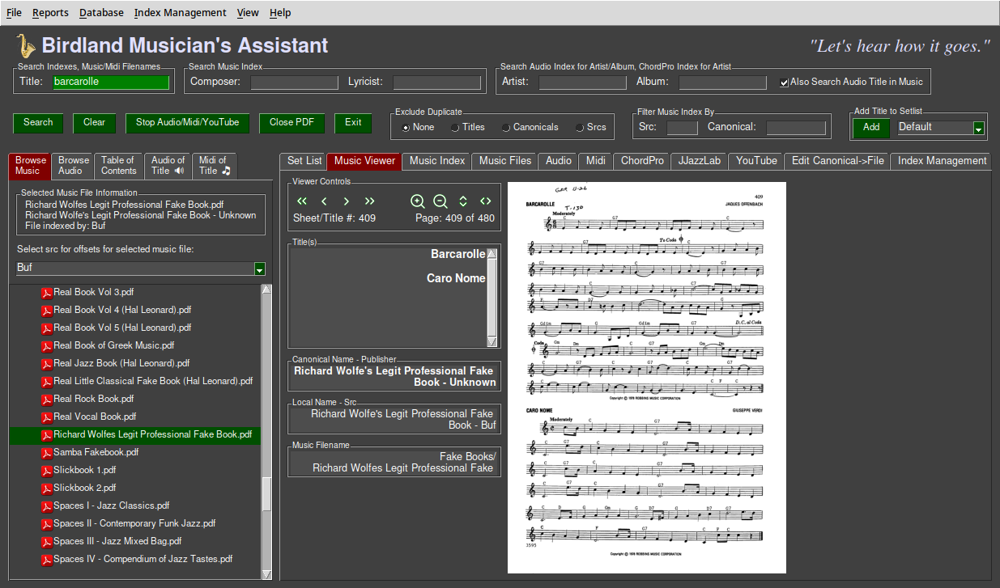

## Terminology

### Music vs Audio
The common (and ambiguous) terms - *music* and *audio* - are used formally here.  You look
at *Music*; you listen to *Audio*.  That is, *Music* is derived from the printed page,
*Audio* from performance.  The term *Book* is used informally to refer to a *Music* book.

### Raw Indexes

A key feature of Birdland is the ability to locate title in a book by searching a
database.  This requires an index that maps song titles to pages in PDF files.  Birdland ships
with raw indexes compiled from several online sources, one extracted from the table of
contents of a collection of music books (of those having a table of contents) and
a small one created during testing.

Each raw-index source has a short, three
character identifier called ***Src***.  Each raw-index source also has a longer, descriptive
identifier called ***Source*** though that has less visibility than *Src*.

### Music Book Identifiers
Every music book has three identifiers.  The ***Local Name*** is specific (or local) to each
raw-index source and created by the person compiling the index. *Local* names are often
cryptic and non-unique across different index sources. 

The ***Canonical Name*** is descriptive, is unique over all music books, and was selected by
author of Birdland.  It is typically the same or similar to the name of the book, possibly
normalized and disambiguated, particularly for for *Real Books* from Sher, Hal Leonard and
the originals from Berkeley Music College. 
The local name is mapped to the canonical name by a file, *Local2Canon.txt*, in each of the raw-index source directories.

The ***File Name*** is the name of the music file, i.e. the PDF file containing music, in
*your* music library.  
The canonical name is mapped to the file name by a file, *Canonical2ile.txt* in the configuration directory.
Birdland includes a tool for managing that file or you can use your favorite text editor.
> The *Canonical2File.txt* file must exist before Birdland can find your music files.

### Page Number, Sheet Number, Title Number
Two common (and also ambiguous) terms, *Page* and *Sheet*, are also used formally
here. 

The ***Page Number*** of a title exists within the domain of a PDF file and what is shown by PDF
readers.  Page numbers are sequential starting with one, have no gaps, and increase by one for each page in a
book. (Internally, page numbers start at zero but that's hidden from the user.) Some PDF files have
non-numeric page numbers (yes, an oxymoron), often for front matter. Birdland does not deal with non-numeric page
numbers.

The ***Sheet Number*** of a title is usually what is shown on the visual page.  In the general case
*Page* and *Sheet* numbers are not the same and vary by raw-index source.

*Sheet* numbers increase monotonically, there is only one per page, they are assigned for
continuation pages, and they may have gaps, for example, because of omitted photos.

A small number of books identify titles with a ***Title Number*** instead of a *Sheet Number*.
*Title Numbers* increase monotonically, there can be one or more per page, they are not assigned to
continuation pages, and they may have gaps, for example, because of a structured title numbering system.

The relation between *Page* and *Sheet* (or *Title*) numbers is established by a file
named *Sheet-Offsets.txt* in each of the raw-index source directories.
It contains one or more pairs of numbers.  Starting at the sheet represented by the first
number the *Page* number is obtained by adding the second number to the sheet number.  For
some index sources the *Page* number and *Sheet* number are the same.

The distinction between *Sheet Number* and *Title Number* exists only for creating new indexes.  It
controls the automatic incrementing of the sheet/title number when skipping a page and displaying a
nastygram when a sheet/title number is not given.

> The indexes included with Birdland but which were obtained from external sources are inconsistent
in sheet numbering and none make use of title numbering.  For some, the page and sheet numbers are
the same but the sheet numbers do not agree with the printed page.  For others, the sheet number is
offset from the page number and do agree with the printed page.  The benefit of title numbering only
accrue when creating new indexes with Birdland.

> **Editorial -** We assert that *Sheet Number*, not *Page Number*, should be published in raw indexes.
The sheet number is constant, as fixed as the ink in the book, whereas the page number is not.
Different people doing scans may have different approaches
to front matter, photos, back matter, etc., resulting in multiple incompatible scans. A small, simple
offset file, not an entirely new index, brings those divergent scans into agreement.
And the sheet number can be used to locate a title in a physical book whereas the page number cannot.

## Foundational Concepts

### No Copyrighted Media

Birdland ships with no copyrighted media - music, audio or midi.  You
must supply your own media, which is available from many online sources, or from your own
scans.  It does include music indexes for many popular books.  Indexes are lists of facts
and, as such, not subject to copyright.

### Text-based Primary Input Files

The primary input files - raw indexes, local to canonical maps, canonical to file map,
title corrections, etc., are all text-based.  Birdland include tools for editing
most or you may use your favorite text editor.

A corollary of this is that no user input is stored only in the Birdland database.
The database may be rebuilt freely without the loss of data you have entered.

### Multiple Raw Indexes

By comparing indexes from multiple sources it is possible to identify incorrect
sheet numbers, alternate title spellings, and omitted titles. Of course, this is only
meaningful if the sources were built independently, which does not appear to always be the case.
And, of course, this only works when multiple sources exist. A book with only one index
source may have error that can only be identified by viewing each page.

> At some point, we're not there yet, but at some point all index sources
will agree.  When we get there then there will no longer be a need for
multiple raw indexes.  Instead, we will consolidate all indexes into one
and ship only that one with Birdland.  We will also normalize all sheet numbers to agree
with the printed sheet and include an offset file to map to PDF page.
We hope users will contribute to this effort.

### Normalized Titles
Titles for the same song in the raw indexes vary in several ways: capitalization, spelling errors,
differences in punctuation, inclusion of subtitles, leading or trailing articles *A* and
*The*, possibly in parens, key signatures, diacritical marks, certain source-specific
quirks such as leading or trailing items, and more.

Ideally, there would only be one representation for each title.  We're not there yet but
Birdland includes the tools to move in that direction. At an early step in raw-index processing    
Birdland checks each title against sixteen patterns of potential mismatches including those described above and automatically corrects to a normalized form.

Using one of the tools in *Index Management* users can manually add corrections that
cannot be done automatically.  Those corrections are then applied on a subsequent raw-index
processing step.

Punctuation in the raw index is preserved in the database so that the displayed titles appear the same as the printed titles. However, punctuation is generally ignored when searching.

### Screen Size
Development of Birdland was done on both a desktop PC with a large monitor and a laptop with a 13.25" screen and resolution of 1366x768. The layout of the graphical user interface was designed to fit on
the laptop screen though at that size the built-in PDF viewer is barely
usable - an external one using the full screen height is a better choice. The laptop screen
also constrained the number and placement of UI features including buttons, textboxes, and tabs.
We believe the compromises required to support smaller screens will be appreciated by some users.

### Programming is More Fun Than Bookkeeping
Index management involves a lot of bookkeeping, e.g. identifying page mismatches between
index sources, aligning page numbers, editing mapping files, etc.  The time to develop the
Birdland tools to minimize the bookkeeping effort likely exceeded many fold the time to
just do the bookkeeping manually.  But it was more fun.


## Features
### Music Viewer Features

* Locate music by searching for the song title, composer or lyricist in the music index,
the title in the music index matching the artist or album in the audio index, and the the
title in the music filename.

* Locate audio by searching for the song title, artist, and album in data extracted from
metadata in the audio files.  Audio file names are not searched because they normally
overlap the metadata.  The titles obtained from searching the audio index may optionally
be included in a search of the music index.  This provides a means of identifying titles
by artist and album metadata, which is in the audio files index but not in the music file
index.

* Locate midi by searching for the song title in the midi filename.  Midi files contain no
reliable and uniform metadata so only the filename is searched.

* Locate ChordPro songs by searching for the song title and artist in data        
extracted from the ChordPro file and folder names. Presently no metadata is extracted
from the ChordPro file content.

* Locate JJazzLab songs by searching for the song title the in data
extracted from the JJazzLab filenames. Presently no metadata is extracted
from the JJazzLab file content.

* Locate YouTube pages by searching a table created by looking up all titles in the
authors library.

* Manage setlists.

* Edit the *Canonical to File* table.

* Option to use built in PDF viewer or external one.

### Index Management Features
* Compare indexes from multiple sources. View the title indicated by sheet number of each source
to determine the correct one. Go directly to the line in the raw index to edit incorrect
titles or sheet numbers. Harmonize alternate title spellings by selecting one from two or more
alternate choices.

* Inspect the raw index for each *Src* and *Local* book name and view the title to establish
correct sheet offsets.

* Create an index for a book not previously indexed. Workflow-optimized user interface with
user-guided title OCR. Automatic title OCR where titles are in the same location on successive
pages. Automatic sheet number increment.

  Where the song titles are clearly legible, i.e., not written over a staff lines as is the case in some of
  the *Real Books*, and especially if they are in the same location on all pages, it is
  possible to index a book quickly with user input only to enter the first sheet number and correct OCR errors.

* Edit the Local to Canonical file for each *Src* and *Local* book name.

* Screen magnifier for viewing small sheet numbers when creating an index.

### Other Features

* Birdland uses the Sqlite3 database by default but will use MySql via a command-line
option. To use MySql you must first manually create a MySql database called *Birdland* with appropriate permissions.
Thereafter, Birdland will create and populate the tables just as it does with Sqlite3.

* Support for use on multiple hosts using a shared configuration file with host-specific
sections for settings likely to vary by host.


## Installation

### Download

> For early releases Birdland is only package as a tar file or for access from GitHub.  Disregard
all else below.  The *PyPi*, *PyInstaller*, and *Nuitka* packages were built successfully earlier in
the development cycle.  The software used to build *PyPi* package and the Birdland folder structure
both changed incompatibly since then.  In the interest of a timely release *PyPi* installation is not presently
supported. The *PyInstaller* and *Nuitak* packages are huge, around a gigabyte.  That size is not
justified by the benefits of a self-contained package so self-contained packages are also not presently supported.


Birdland is packaged in several forms:

* As a tar file.
  This is likely to be familiar to techy users but does nothing automatically. You will
  have to be sure Python and all required Python modules are installed.
* At GitHub. This is essentially the same as the tar file above.
* For installation via *PyPi*.
  This is also likely to be familiar to techy users and automatically installs all require
  Python modules.
* As as self-contained file build by *PyInstaller*.
* As as self-contained file build by *Nuitka*.
    These are likely to be the easiest to install as they include the Python
    interpreter and all required modules but they still require a recent glibc and the
    download files are quite large.

See the 
[Birdland web site](https://birdland.wrwetzel.com)
for download links and package-specific instructions.  The
package-specific instructions (one of ReadMe-Tar.md, ReadMe-Pypi.md, ReadMe-Nuitak.md, and
ReadMe-PyInstaller.md) are also included in the installation package for reference during
installation.

### System Requirements

Birdland is presently supported on Linux.

Birdland requires the Python 3 interpreter. This is likely installed on most modern Linux
distributions, is included in the self-contained packages, but will have to be installed
for the Tar and PyPi installation if not already present.

Birdland requires the following Python modules. These are installed automatically if installing
Birdland from PyPi, are included in the self-contained package, but have to be installed manually
when installing Birdland from the tarball.

```   
click
configobj
Levenshtein
mutagen
mysqlclient
pandas
pillow (only if using Create Index feature)
PyMuPDF
PySimpleGUI
pytesseract (only if using Create Index feature)
tk
unidecode
youtube-search-python (only to run get-youtube-links.py)
```

Birdland includes the source and binary for one module, *fullword* (a misnomer of fulltext), written
in C but falls back to an alternate match strategy if that is not available.  There are presently no
build instructions in the installation process to recompile that if the existing binary is
incompatible with your system.  Execute *run.sh* in the *Fullword-Match* directory under the
birdland source directory if you have a C-development environment on your system.

Birdland optionally need one or more of the following if you want to view or hear the
related files from your libraries.

* An audio file player to play audio files matching a music title.
We have tested with the *vlc* audio player.

* A PDF viewer if you prefer to use an external one in lieu of the built-in one.
We tested with the *okular* PDF viewer though we generally use the build-in viewer.

* A midi player to play midi files. 
We tested with the *timidity* midi player with the *FluidR3_GM.sf2* sound fount.  The
*FluidR3_GM.sf2* sound font has good coverage of General Midi instruments and remarkably
good samples.

* ChordPro viewer to view ChordPro files.
We tested with the *chordpro* ChordPro viewer.

* JJazzLab to work with JJazzLab files. 
No choice here but JJazzLab.

* A web browser for viewing YouTube links.  
We like the *qutebrowser* browser for its simple, non-distracting user interface.    

## Status
A wise sage posited that *Perfect is the Enemy of Good*. With that in mind we decided to release
Birdland with a few known issues to expose it to a wider user base.

At this stage in development and packaging, especially packaging, Birdland will be more attractive to techy users.

The Birdland application has been reasonably well tested during development but has not
yet been exposed to many users.  Corner cases or un-anticipated inputs and sequence of
inputs will inevitably emerge.

Development and testing was done on an up-to-date Arch Linux system with the Plasma (KDE) desktop environment. 
Incompatibilities with
other Linux distributions or older versions of Python and Python modules, and other system software are
possible. Conflicts with the glibc library are specifically a concern with the self-contained packages.

The consolidation of the multiple index sources is not complete. The correct page is found for most titles
in popular fakebooks but some page errors and alternate spellings of titles remain.

Birdland has a *theme* option but light themes are discouraged.  Most of the testing was
done with the *Dark* theme - we recommend that for early users.  Birdland specifies a few
user-interface colors that work better with dark themes. No work has been done yet to adapt
the specified colors to light themes.  Most embarrassing, the *Birdland* title just about
disappears with light themes.  While color is used sparingly in most of the user interface
(just the title, input boxes, and tabs) it is used in the *Create Index* feature to convey the source of the title, either manual, manual OCR, or automatic OCR.

The power of *Full Text* searching is available only if using the MySql database.  Since
most, if not all, users will prefer Sqlite3 for its simplicity and speed, MySql *full text*
serching is not possible.  We were unable to use the *full text* feature of Sqlite3 either because
it is buggy, we didn't understand it, or both.  However, we did implement approximations of *full
text* in a number of different ways.  By default, Birdland uses a small *C*-language
routine for *full-text* matching.  Because of the uncertainties of access to that routine in
some environments Birdland will fall back to an alternate implementation using SQL
*LIKE* matching if the C implementation cannot be loaded.  There will be small variation
in search results between the two implementations and *LIKE* is a bit slower.

## Getting Started

### Settings

When Birdland starts for the first time it:
* Creates a folder, *.birdland*, in your home directory
  (and also as specified by the *-c confdir* option, if given).  
* If using *Sqlite3* (the default case if MySql is not specified) it creates an empty database in ~/.birdland/Birdland.db.  
* It populates the default or specified configuration directory with:
    * A default configuration file, *birdland.conf*
    * An empty setlist file, *setlist.json*
    * An empty canonical to file map file, *hostname-Canonical2File.txt*
    * A sample canonical to file map file, *Example-Canonical2File.txt*
    * An empty audio index, *hostname-Audio-Index.json.gz*, 

Note that *hostname* above is the name of your host.
The hostname is included in the canonical to file and audio index filenames so you can run Birdland
on multiple hosts with a common, shared configuration directory, each with different music and audio
libraries.

* Birdland then prompts you set up your configuration in the settings menu:
*File->Settings*.  The *birdland.conf* file is an ordinary text file, which
you can edit it directly with a text editor if you prefer.

* There you tell Birdland the location of your music, audio, midi, ChordPro and JJazzLab
libraries.  Each of these is specified by a root directory and a list of one or more
directories under the root.

* Birdland needs to know the mapping between the canonical music file names used in the
index and the names of the music files on *your* system.  You can populate the
canonical-to-file map file using the build-in tool in the *Edit Canonical->File* tab or
with a text editor.  The file consists of one line per music file containing the canonical
name and the music file name separated by a vertical bar.  A reasonably-complete example
is in *Example-Canonical2File.txt* to use as a starting point.  You may find that the file
names in that are quite close to your music file names and only minor edits are needed.
Or you might prefer to change the names of your music files to match that file.

* Next click *Database->Scan Audio Library* if you intend to include your audio library in the
Birdland database.  This can take some time if you have a large audio library, perhaps
around a half-hour for a half-terabyte of audio files. You can defer this until later if
you are anxious to get started. Birdland gives you chance to cancel the scan if you accidentally click
this item.

* Finally click *Database->Rebuild All Tables* to build the database from the
index data shipped with Birdland and the additional data you entered
above.  This typically takes thirty seconds or so.

There are several more options that are not needed to get started.  We'll
get to those later.

### Operation

* Enter a title in the green text box labeled *Title* and hit *Enter* or click *Search*. 

  Birdland searches for *all* the words entered in the order they appear.
  This is similar, but not identical, to *full text* supported by
  MySql and Sqlite databases.

  Birdland searches for the title in the music index, the audio index, in the music
  filenames, the midi filenames, the ChordPro index, the JJazzLab index and the YouTube
  index and activates the tab for the first match found in the above order.

* Click on a row in the *Music Index* tab to view the music file found by title (or other search parameters),
  the *Audio Index* to play the audio file, 
  the *Music Files* tab to view the music file found by filename, 
  the *Midi Files* tab to play the
  midi file, the *ChordPro* tab to view the ChordPro file, 
  the *JJazzLab* tab to launch JJazzLab for
  the title, and the *YouTube Index* to view the YouTube video for the title.

  The number of matches of each type appears in *Status Bar* at the bottom of Birdland.  Note that
  the maximum of number of matches returned is limited by an options in *Settings*, default 100.

  

* And now, the multimedia feature manifests.  If a speaker icon appears in the *Status Bar* then
the title of an audio file matches the title shown in the music viewer.  Click on the *Audio of
Title* tab in the left sidebar and then a line in the *Title/Artist* table to play the audio.
  
* If a music notes icon appears in the *Status Bar* then the above applies but for midi files
  
* Add a title to a set list by clicking the *Add* button in the *Add Title to Setlist* panel. Create a new set list by typing the new name in the drop-down menu in lieu of selecting an existing one.


## Abbreviated Reference Manual

UNIX Programmer's Manual, Seventh Edition (now 43 years old) includes the following comment:

> Within the area it surveys, this volume attempts to be timely, complete and concise. Where the latter two objectives conflict, the obvious is often left unsaid in favor of brevity.

In that spirit the function of most the user menus and controls should be self-explanatory from the
tab, button, or panel labels.  Here are just a few items that may not be obvious for reference while using Birdland.

### Command Line

Birdland is executed from the comand line with *birdland* and it may appear in the system menu if supported. 

#### -c confdir
Use *confdir* for the configuration directory instead of the default *~/.birdland*.  You may want to
do this to locate the configuration information in a shared or cloud-based directory such
as Dropbox so that you can use the same configuration information on multiple systems and
so that it is backed up.

This option does not affect the location of Sqlite3 database, which is always in *~/.birdland*. It can be easily and quickly
regenerated and you may not want it in cloud storage because of its size.

#### -d mysql
Use the MySql database in lieu of the default Sqlite3 database.

### Additional Commands

Birdland includes a few additional commands.

* bl-build-tables (links to build_tables.py)
* bl-diff-index (links to diff_index.py)

Ordinarily, the above are run via the menu in Birdland but are exposed for advanced users who prefer to run them outside of Birdland. These commands are not further documented. Use the *--help* option for some guidance on use.

* Index-Sources/ExtractedIndex/extract-index-from-pdf.py - This scans your music library and extracts indexes from PDF files containing indexes.
* build-pdf-from-image.py - This converts image files in your music library to PDF files and places them in the folder indicated by the *music_from_image* option in the configuration file, default the *Converted_from_Image* directory under the root of your music library.  It assumes that all image files for a single song are in one folder and places the PDF output in a file named for that folder.

### Menus


#### File->Settings
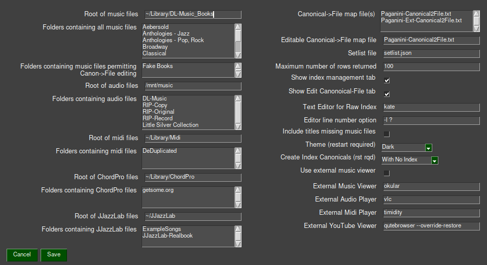

##### Folders containing music files permitting Canon->File editing

This was used to restrict the files in the *Canonical Name* table in the *Edit Canonical->File* tab to just files in the folders included in this option. It is not currently used.

##### Canonical->File map file(s)

This defines one or more files containing the canonical to file mapping. Presently, one map file was created by hand while the other was created by the program that built the *Ext* raw index by extracting index data from all PDF files in the music library containing an index.

##### Editable Canonical->File map file

Only the canonical to file map in this option is shown in the *Edit Canonical->File* tab. This is the file in the above option that was created by hand. There is no reason to edit the map created by the index extraction program and it cluttered the table.

##### Include titles missing in music files

When searching the music index titles without a corresponding music present are ordinarily excluded from the results shown in the *Music Index*. Check this option to include those files. You may want to do this to explore the music index before you have set up the canonical to file map for your music library.

#### Database

##### Rebuild Sheet-Offset Table, Rebuild Canonical to File Table

These items are a subset of *Rebuild All Tables* item. They are includes separately so users working on the *Sheet Offset* and *Canonical to File* files don't have to rebuild the entire database when working on just those files.

#### Index Management

##### Process Raw-Index Sources

This executes each of the *do_\*.py* scripts in the source-specific folders in the *Index-Source* directory. Each of those scripts converts their associated raw indexes into a consistent format in the *Music-Index* directory. It must be run after editing the raw index files. It does not have to be run after editing the *Sheet Offset* or *Canonical to File* files.

The remainder of the items show reports summarizing differences between index sources for the same book and another report showing the details of such differences. The summary reports show progress on harmonizing index sources and identify books needing attention. The detail report is redundant with the information on the *Index-Management -> Index Comparison* tab but some users might prefer to see the differences in a report.

#### View

The controls here are redundant with options in the *Settings* menu but are provided for users who want to quickly view one of the indicated tabs without going to *Settings*. Most users will have no need for *Index Management* and little need for *Edit Canonical->File* once they have configured Birdland for their system. Hiding these tabs reduces clutter and hides unused tabs.

#### Help

##### About Birdland

Please copy-and-paste the contents of the *About Birdland* window into the *Contact* form when
contacting us with a problem.  You may also find it handy as a reminder of the directories used by
Birdland.

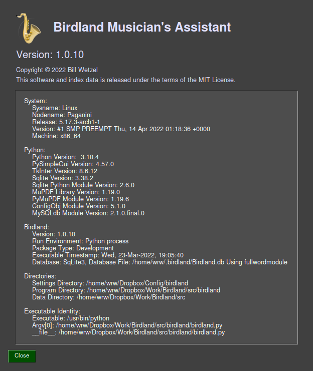

### Search and Search Controls


##### Also Search Audio Title in Music


The metadata accompanying some titles includes composer and lyricist but never artist and album as neither has a unique mapping to a title. Nevertheless, users may want to search for a title based on an artist who recorded it or an album where it appears. With this option checked and with a value for artist and or album the audio index is first searched for these items. The titles found in the search are then searched for in the music index as if they were entered in the *Title:* search box.

##### Browse Music

Title shown in the *Music Index* tab include the *Src* and *Local* for the raw index from which the title was obtained. That is not the case for books selected from the the *Browse Music* tab in the left sidebar, a file browser for all books in your music library. Select the index *Src* in the drop-down menu to use the  associated index when viewing the book it in the *Music Viewer* tab.

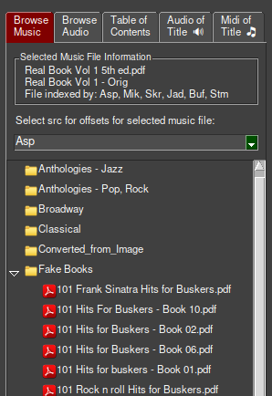

##### Audio of Title, Midi of Title

As each title is displayed in the *Music Viewer* tab the audio and midi tables are searched for the title. Titles found there are displayed in the *Audio of Title* and *Midi of Title* tabs in the sidebar on the left of the window. Click on an item in either tab to immediately hear the song while viewing the music for it without the need to locate it in the *Audio* or *Midi* tabs.

### Tabs

#### Edit Canonical->File

Unless your music library directory structure and book names matches that in **Example-Canonical2File.txt* you will have to tell Birdland how to map canonical book names to your music files. This is done in the *Edit Canonical to File Tab*.

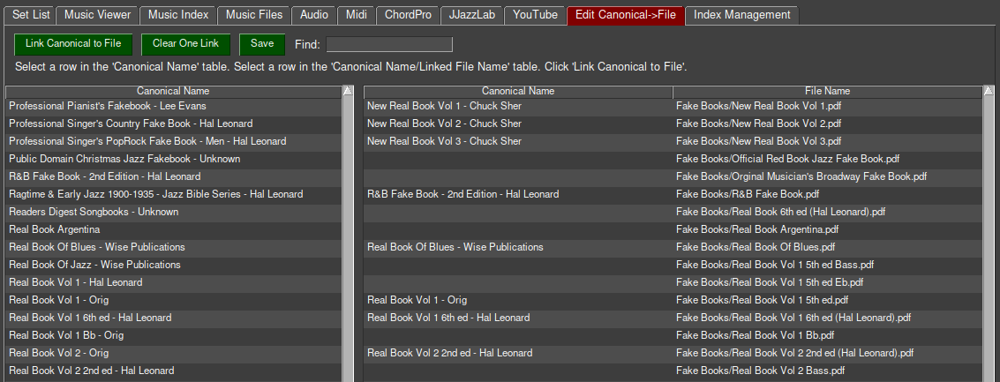

* Click on a book in the *Canonical Names* table and a book in the *Canonical Name / File Name* table.
* Click the *Canonical to File* button to link the selected canonical name to the file name.
* Click *Clear One Link* to undo a link.
* Click *Save* to save the table to the *Canonical2File.txt* file.

Presently there is no control on this tab to add a new canonical name or file name. This has to be done by manually editing the *CanonicalNames.txt* and *Canonical2File.txt* files.

## Index Management                                                    

The material in this section is applicable only if you are working at the raw index level.
This includes adding a new index source from an external source, correcting errors in the
indexes shipped with Birdland, or creating an new index. 

Many Birdland users will never deal with index management. For that reason you can hide the
*Index Management* tab with an option in settings.

Here we use the term *Left Click* to indicate mouse button 1, and *Right Click* for mouse button 3.
Apply the obvious correction if you have mapped your mouse buttons differently. The *Right Click* is often used for a quick view of a title in a pop-up window.

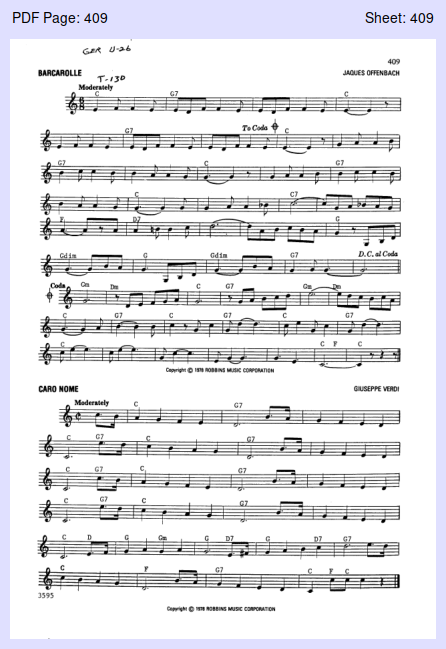

### Index Comparison Tab
Here you compare the sheet number (and offset-mapped page number) for all *Src*s covering all indexed
books, correct errors in the raw indexes, and determine the offset between sheet and page.

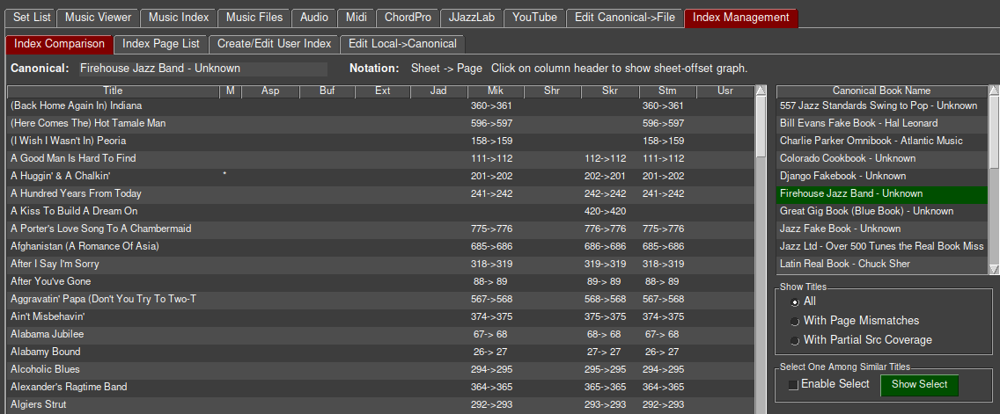

* Click in the *Canonical Book Name* table on in the column on the right to display all titles from that
book and the sheet number and page number mapped from the sheet number for all *Src*s covering the book.

* Left click on a value in the *Src*-specific columns to view the
page indicated by the number to the right of the arrow (the page number). Use this
to identify pages with incorrect sheet numbers in the raw index.

* Left Click on the column headers of the *Index Comparison* table to display a chart of the
  *Sheet Offsets* for *Src* indicated by the column header.  This is pure eye candy and will
  likely disappear.  Most of the fakebooks have a constant sheet offset.  Only the
  *Standards Real Book - Chuck Sher* with a *Src* of *Buf* or *Shr* have an interesting
  chart. The original book included many photographs of performers but those sheets were omitted in the
  scanned PDF. The *Buf* and *Shr* indexes have correct sheet numbers and, thus, the sheet offset has to be adjusted
  for each photograph. The *Asp* and *Mik* indexes have sheet numbers matching page numbers so that a constant
  sheet offset of 0 is used for the entire book.

  > *BUG* - because of a limitation of the user-interface software this feature only works when the table
  > is scrolled to the *top*. Otherwise, a PDF page is displayed.

  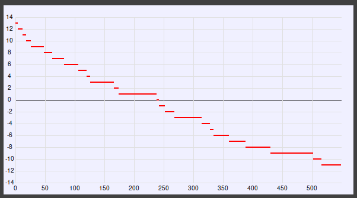
  
* Right click on a value in the *Src*-specific columns to launch a text editor with the raw index file opened
to the line containing the title. This is an important feature, which makes it easy to correct errors in the raw index without the need to navigate the raw-index directories and search for titles.

* Right click on in the *Title* column to launch a text editor with the raw indexes for each of the
  *Src*s opened. Only one of the lines will be correctly selected - you will have to search for the title in
  the other raw index files.

* Changes you make to the raw index will appear the next time the raw index is processed.

Titles from different index *Src*s for the same song frequently differ in small ways such as punctuation, sub-title, parenthesis, and more. While it would be possible to edit the raw indexes to bring them into agreement that can get tedious. Instead, Birdland has a much faster solution.

* Click on *Enable Select* in the *Select One Among Similar Titles* panel in the right sidebar.
* Control-Left-Click on two or more similar titles.
* Right-Click on any of the selected titles or click *Show Select* in the right sidebar to display a popup with all the selected titles. 
* Click the desired title and *Save*.
* That will add an entry to a corrections file (*Canonical/Corrections.A.txt*) that will be applied to the raw index the next time it is processed. 

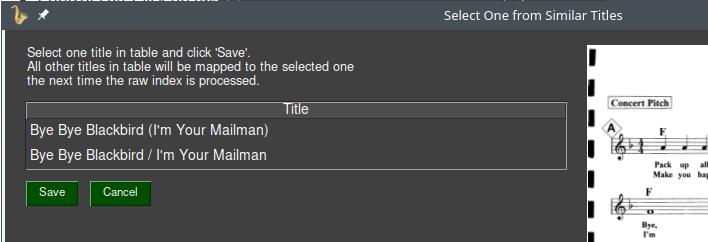

### Index Page List Tab
Here you view the index details for one book from one Src.
Use this to determine the sheet offset for the manual creation of the *Sheet Offset* file.

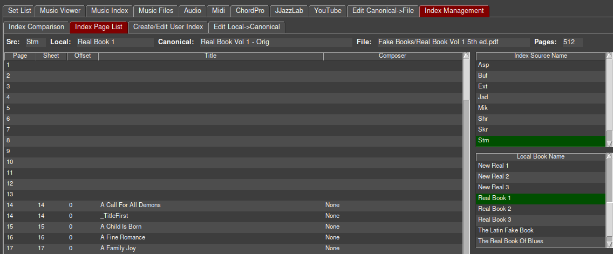

* Click on a *Src* in the *Index Source Name* table in the column on the right. That will display a list of *Local* book
names covered by the *Src*.

* Click on a book in the *Local Book Name* table to display index information for that *Src* and *Local* name
combination in the main table.

* Left click anywhere in a row in the table to view the PDF page indicated by the *Page* column.

### Create/Edit User Index Tab
Here you create an index for books that have not yet been indexed or continue work on an index
you already started here. Books for indexing are shown in the table at the bottom of the left side of the tab.
By default this shows *Canonical Books - With No Index*. This can be changed with a *Settings* option though
the default setting is likely suitable for most needs.

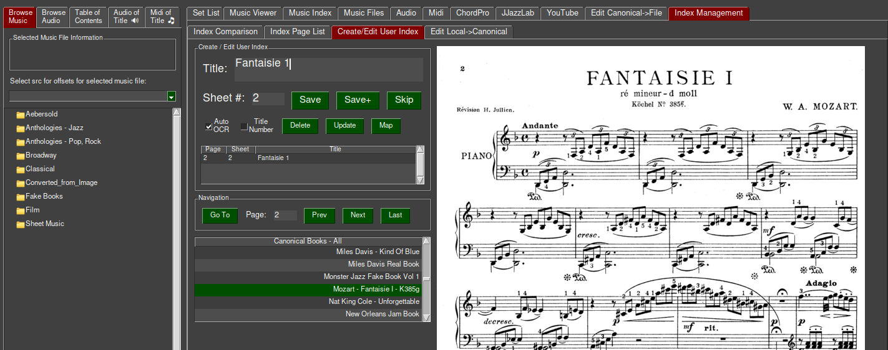

* Click the *Title Number* check box if the book you are indexing has *Title Numbers*, otherwise they will be considered *Sheet Numbers*. Remember, the distinction only concerns how the number is incremented on *Skip*.

* Click on a canonical book name in the *Canonical Books - With No Index* table. This will display the
  PDF file for that book in the PDF display. Page 1 is shown if this is the first time you are working on this book.
  The last page you indexed is shown if you are returning to a book on which you previously worked. 

    > Reminder, you have already entered a sheet and title for this page. Click the *Next* button to advance to the first page that has not been labeled.

* Draw a box around the title by left click and drag. The title will be processed by OCR and displayed in the *Title* box. Correct any OCR errors. Alternatively, you can type the title
in the *Title* box but there is little reason to do so when the title is clear and easily recognized.

* Enter the *Sheet/Title* number. This is the number printed in the book, not the PDF page number. On subsequent pages
the number will increment automatically. If the book does not have sheet/title numbers then, and only then, use the page number. 

* Right-Click and drag in the viewer window to magnify sheet numbers or other content that is too small to see.

  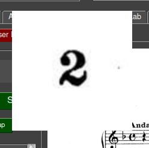

* Click *Save* to save the current title but stay on the page. Appropriate when the page contains multiple titles.

* Click *Save+* to save the current title and advance to the next page. Appropriate when the page contains one
  title or on the last title when it contains multiple titles.

  > For both *Save* or *Save+* the current entry is added to the raw-index file and the sheet-offset file is updated.

* Click *Skip* to save a dummy title of *\__Skip__* and advance to the next page.  Appropriate
when the page contains a continuation of a page previously indexed page, a photo, or other non-titled content.
The *\__Skip__* title is a marker to indicate that the page was processed in the *Coverage Map* but is not included in the database.

* If the *Auto OCR* box is checked (the default) when *Save+* or *Skip* is
  clicked then the title selection box is retained and the content of that box on the next page is processed
  by OCR. This is appropriate where titles are in the same location on the page and are not obscured by
  staff lines.

* *Save*, *Save+*, and *Skip* require a title and sheet/title number to prevent inadvertent errors. For the same
reason they do not permit saving a title that has already been saved for the same page. You must first *Update* it
or *Delete* it.

* The navigation buttons *Go To*, *Prev*, *Next*, and *Last* have no such requirements. Be careful. *Last* navigates
to the last page indexed, not the last page in the book.

* Click on *Show Map* to display an index coverage map.


### Edit Local->Canonical

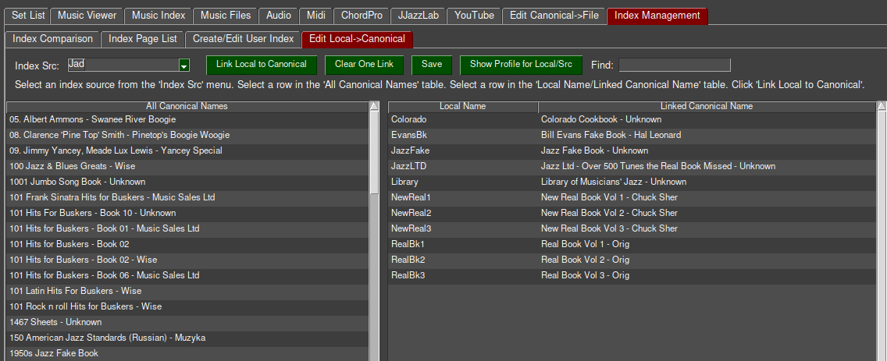

* Select an *Src* from the *Index Src* drop-down menu. This populates the *Local Name / Linked Canonical Name* table
with all books indexed by the selected *Src*.

* Click on a book in the *All Canonical Names* table and a book in the *Local Name / Linked Canonical Name* table.

* Click the *Link Local to Canonical* button to link the selected canonical name to the local name.

* Click *Clear One Link* to undo a link.

* Click *Save* to save the table to the *Local2Canon.txt* file for the selected *Src*.

* Click *Show Profile for Src/Local* to display the first 25 titles from the index for the
  selected *Src/Local*, the number of pages, and a list of books from other *Src/Local* indexes
  similar to the selected book based on the Levenshtein distance (a measure of similarity) between
  the titles. That metric is shown next to the *Src/Local* names. Use this feature to help identify the correct *Src/Local* to link to the canonical.
  
  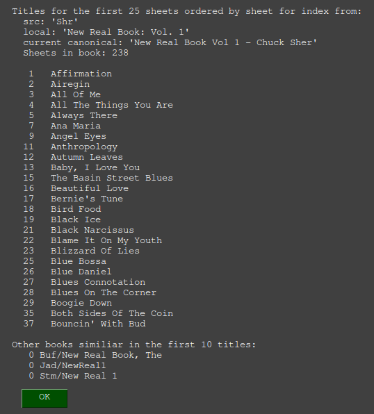

### Adding A New Music Book
* Add book to one of the folders in *music_file_folders* item in the [[hostname]] section in birdland.conf.
* Add/verify canonical book name in *Canonicals/CanonicalNames.txt*
* Add/verify the canonical to file mapping in *Hostname-Canonical2file.txt* in your Birdland config directory.
* Verify that the canonical names in *Canonicals/CanonicalNames.txt* and *Hostname-Canonical2file.txt* match.
* Rebuild the *canonical2file* table.

### Adding An Index Source
* Create new folder in *Index-Sources*.
* Add new *Src* to the *source_priority* item in birdland.conf.
* Add a new section named for the new *Source* in the [*System*] section of birdland.conf

```
[[User]]
src = Usr
folder = User
command = do-user.py
```

* Build and run the do_\<source name>.py script in the folder for your new source.

### Source-Specific Processing

For each source there is a python script, do-\<source name>.py, in a source-specific
directory.  That script reads the raw data in a source-specific form and writes a
*json* file in a common form in the data directory *Music-Index*. The
json file is named with the *src* and *local* name. It contains:

* Local book name
* Source name
* Title and page number for each song in the book.

A few lines from the file:

```
{
  "book": "ColoBk",
  "source": "AdamSpiers",
  "contents": [
    {
      "title": "Afternoon In Paris",
      "page": "17"
    },
    {
      "title": "Algo Bueno",
      "page": "274"
    },
    {
      "title": "All Blues",
      "page": "18"
    },
```

## Future Work
* Harmonize all raw-index sources.

* Port to Windows.

* Expand ChordPro support with lyrics search and key transposition.

* Add GUI tool to build *Sheet Offset* file. This happens so infrequently that manual editing may be sufficient.
* New feature to add entries to CanonicalNames.txt and Canonical2File.txt

* Package in Linux distribution-specific formats.
  

## Random Comments

### Symmetry
We are generally sticklers on symmetry in design - if a feature applies in one case it should apply in all similar cases.
Unfortunately, there are a few instances in Birdland where this was either not possible or desirable.

The sidebar on the left side of the window include tabs for browsing music and audio files. With perfect symmetry it would
also include tabs for browsing midi, ChordPro, and JJazzLab files. Real estate constraints prevent this and, we believe,
with little loss of functionality.

### Book Errors
The *Standards Real Book* music file as found online had a couple of groups of pages out of order. Two of the raw indexes indexed the sheets as found out of order while two others indexed them with
the correct sheet number. We're not sure if this was a scanning error or done intentionally by the person doing
the scanning as a means of tracing copies of the work. Rather than jumping through hoops to correct the out-of-order
pages with sheet offsets it was much easier to just rearrange the pages in the book using the linux *PdfArranger*
tool. If you have such a copy of *Standards Real Book* consider rearranging using *PdfArranger*.

### Raw Index Independence
We found a number of cases where the same errors existed in the raw index from different sources. This strongly implies
the one of them is a copy of the other. Despite this we continued to harmonize all the sources because of the possibility
that there were also differences worth correcting.

### Indexes vs Indices
While using *Indexes* as the plural of *Index* may sound a bit strange it is correct for
textual work with *Indices* being used in mathematics.

## Credits

First an foremost we are indebted to the developers of *PySimpleGUI*. That library, more than any other, enabled the development of Birdland. Earlier work based on the *Qt* library moved at a much, much slower pace.

We acknowledge the indexing work done by creators of each of the raw indexes: Alan Spiers, Jason A. Donenfeld, Mike Nelson, Stomp Box, Skrivarna Software, the Library at the University of Buffalo, and Sher Music. It was specifically the indexes Alan Spiers published on *GitHub* that rekindled our interest to resume the work on Birdland that we started many years ago.

## Dedication

When I, the author of Birdland, was a child my dad gave me a piano lesson every night from the time
I was four until I was twelve, at which point he got fed up out of frustration with my attitude
towards lessons and practice.  I had a good ear but was not very good at sight-reading so I would
often ask him ***Let's hear how it goes.*** Once I heard him play the lesson I had no trouble with it.
Eventually, he got wise to my trick and forced me to sight read on my own.  While I may not have
appreciate them at the time, in hindsight his piano lessons were his greatest gift to me.  I
dedicate Birdland to the memory of my dad.  He would have loved to have a library of thousands of
songs at his fingertips.
